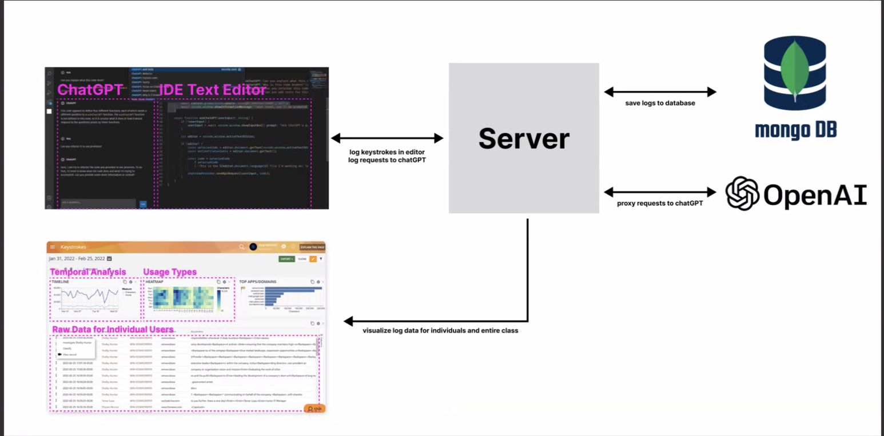

# ChatGPT VSCode Extension Project
The goal of HCiQuery is to understand the best way of structuring a query in order to utilize 
artificial intelligence engines, such as ChatGPT, to the best of your ability. This project will 
have four main stages. The VSCode plug-in enables the capturing of user data, the database to grab 
and store the query data, an in-depth analysis of the extracted data, and finally, a way of 
visualizing the data and explaining the findings to both researchers and developers.

The VSCode plug-in will be an interface located next to the user's code editor that will allow for 
the interaction between user and ChatGPT remotely. User’s will be able to type in anything they 
please, whether it be code to be reformatted or a question regarding anything computer science 
related. Upon entering a query, the plug-in will use a token to remotely connect with the ChatGPT 
API. Once authenticated, the query will be processed with ChatGPT and sent back to the plug-in, 
which will then be displayed to the user within the contents of the editor.

In addition to the response being displayed to the user, the timestamped response and query will 
both be sent and stored in a Firebase database. This database will be organized by time, code 
queries, question queries, and more.

Before we can understand our data, it is important that the data be engineered and analyzed in a 
way that can begin to draw insights before it is visualized. This step will involve a lot of data 
science methodologies for goals such as combining common groups of words, most frequently used 
words, and more.

The last stage, visualization, is when all of the previous steps come to fruition. Researchers and 
developers will be able to accurately visualize how ChatGPT is used, and how people can benefit 
from writing better written queries to help their efficiency at work and in academia.  


# How to run
Provide here instructions on how to use your application.   
- Download the latest binary from the Release section on the right on GitHub.  
- On the command line uncompress using
```
tar -xzf  
```
- On the command line run with
```
./hello
```
- You will see Hello World! on your terminal. 

# How to contribute
Follow this project board to know the latest status of the project: [https://github.com/orgs/cis3296f23/projects/122](https://github.com/orgs/cis3296f23/projects/122/views/2)

### How to build
- Use this github repository: ... 
- Specify what branch to use for a more stable release or for cutting edge development.  
- Use InteliJ 11
- Specify additional library to download if needed 
- What file and target to compile and run. 
- What is expected to happen when the app start. 
