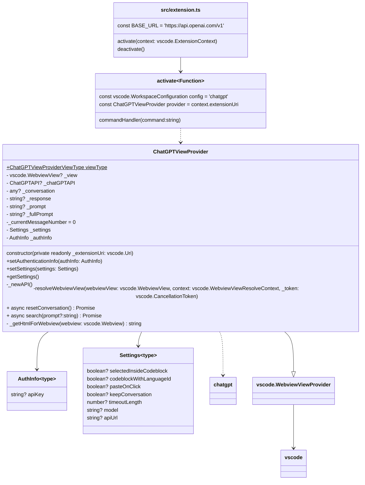

# System Architecture

## Extension Architecture
:::tip Microsoft's Extension Anatomy Documentation
Go check out Microsoft's [extension anatomy](https://code.visualstudio.com/api/get-started/extension-anatomy) documentation for details on the basic structure and definitions of VSCode Extension written in TypeScript.
:::

**Figure 1. VSCode Extension UML class diagram**
Representing the current structure of the VSCode extension is a bit messy and difficult. However, it is worth it to highlight that extension.ts `activate()` registers the view provider `ChatGPTViewProvider`. The provider makes all of the calls to the ChatGPT library from the `search()` function which also updates the `webview`.
